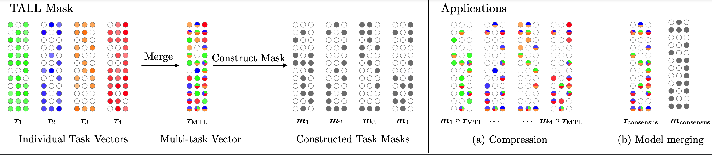

# TALL Masks

This is the source code to reproduce the experiments for "[Localizing Task Information for Improved Model Merging and Compression](https://arxiv.org/abs/tbd)" by Ke Wang*, Nikolaos Dimitriadis*, Guillermo Ortiz-Jimenez, Francois Fleuret, and Pascal Frossard.

Our paper identifies that the task-specific knowledge is preserved after mering, and proposed a method named TALL mask to localize them.
Based on TALL mask, we proposed:
1) a compression scheme which utilizes TALL mask to recover single-task fine-tuned performance for each task
2) a merging algorithm which removes catastrophic and selfish weights to improve model merging performance



## Dependencies

To run the code, please install all its dependencies:
```sh
conda env create
conda activate tall-masks
```

## Checkpoints
We provide the checkpoints, as well as the generated task-specific masks we used in the paper in [this link](https://drive.google.com/drive/folders/15ParSng4d5xSdaWdBFsg1617zPXT8Dae?usp=sharing). Alternatively, you can download the checkpoints and masks by running the following script:
```sh
# model options --model {ViT-B-32,ViT-B-16,ViT-L-14} 
# kind options --kind {checkpoints,tall_masks}
# use python download_checkpoints.py --help for more information
python download_checkpoints.py --model='ViT-B-16' --kind=checkpoints
```

The script downloads *all* the checkpoints for one model corresponding to 40 files (finetuned checkpoint and classification head for 20 tasks). The script used the `gdown` package to download the files. If you encounter any issues, please refer to the [gdown documentation](https://github.com/wkentaro/gdown?tab=readme-ov-file#faq). A common issue is that the download quota is exceeded, in which case you can download the files manually from the [Google Drive folder](https://drive.google.com/drive/folders/15ParSng4d5xSdaWdBFsg1617zPXT8Dae?usp=sharing) or modify your local cookies file as described in the gdown documentation.

## Datasets
Most datasets being used should be downloaded automatically with torchvision or huggingface. For the datasets requiring manual preparation, please follow the instructions in [this issue](https://github.com/mlfoundations/task_vectors/issues/1). Depending on the torchvision version, some issues might arise when downloading specific datasets like [here](https://github.com/basveeling/pcam/issues/4) or [here](https://github.com/pytorch/vision/issues/5662). In this case, using a different torchvision version might solve the issue. 


## Localizing Task Information with TALL Masks

Below gives an example of pseudo-code to use TALL mask to localize the information in multi-task vector to reconstruct the individual checkpoints.

To create a task vector, you will need a pre-trained checkpoint and a fine-tuned checkpoint:
```python
from task_vectors import TaskVector
task_vector_A = TaskVector(pretrained_checkpoint, finetuned_checkpoint_A)
```
Create a multi-task vector:
```python
multi_task_vector = task_vector_A + task_vector_B + task_vector_C
```
Construct tall mask:
```python
tall_mask_A = task_vector_A.abs() > (multi_task_vector - task_vector_A).abs() * lambda
```
Reconstruct fine-tuned model with tall mask:
```python
# the reconstructed finetuned_checkpoint_A has near the same performance as original finetuned_checkpoint_A
reconstructed_finetuned_checkpoint_A = pretrained_checkpoint + multi_task_vector * tall_mask_A
```
## Finetuning
The script `finetune.py` can be used to reproduce the training protocol we used to fine-tune our models on all our downstream tasks.
```sh 
# Finetune on 2 GPUs
python finetune.py --model=ViT-B-32 --world-size=2 
```

## Evaluation

### Model merging evaluation

Evaluation is performed with Hydra, please modify `model_location` and `data_location` in `config/config.yaml` before evaluation. 

##### Evaluate with baseline model merging methods:
```bash
# Evaluate with Task Arithmetic
python main.py model=ViT-B-32 method="sum" 

# Evaluate with Ties-merging
python main.py model=ViT-B-32 method="ties" method.k=20
```
##### Evaluate with TALL mask + model merging methods:
```bash
# Evaluate with Tall mask + Task Arithmetic (load tall masks from storage)
python main.py model=ViT-B-32 method="tall_mask" method.load_mask=True

# Evaluate with Tall mask + Task Arithmetic (construct tall masks from scratch)
python main.py model=ViT-B-32 method="tall_mask"

# Evaluate with Tall mask + Ties-merging (load tall masks from storage)
python main.py model=ViT-B-32 method="tall_mask" method.use_ties=True method.load_mask=True

# Evaluate with Tall mask + Ties-merging (construct tall masks from scratch)
python main.py model=ViT-B-32 method="tall_mask" method.use_ties=True 
```
##### Evaluate with Consensus Merging (after constructing TALL masks):
``` bash
# Evaluate with Consensus Task Arithmetic
python main.py model=ViT-B-32 method="consensus" method.prun_thre_k=2

# Evaluate with Consensus Ties-merging
python main.py model=ViT-B-32 method="consensus" method.prun_thre_k=2 method.use_ties=True
```

Note that you can set different number of tasks by setting `num_tasks`. Then, the first `num_tasks` are going to be selected from the list defined in `src/utils/variables_and_paths.py`. Alternatively, you can directly specify the tasks as a list of strings. The results of the papers can be retrived by setting `num_tasks` to 8, 14 and 20 for the corresponding experiments.

### Single-task evaluation
You can evaluate the performance of the fine-tuned weights on each single task by running
```sh 
# Evaluate pre-trained models.
python eval_single_task.py --model=ViT-B-32 --finetuning-mode=none

# Evaluate non-linearly fine-tuned models.
python eval_single_task.py --model=ViT-B-32 --finetuning-mode=standard
```

The results are saved in the `results/` folder. 

## Reference
If you find this code useful, please cite the following paper:
```bibtex

TBD

```

